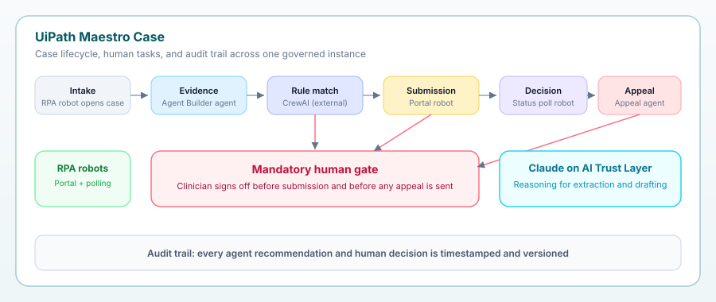

# Auth Pilot Health

> Agentic prior authorization case management that keeps a clinician in charge of every denial and appeal.

Auth Pilot Health is a provider-side prior authorization workspace. We treat
every request as a living case that moves through intake, evidence gathering,
payer-rule matching, submission, decision, and appeal. Agents and robots do the
paperwork; a clinician stays legally and visibly in charge of every
medical-necessity decision through a mandatory human gate.

Built for **UiPath AgentHack** (Track 1: Maestro Case).



## Why we built it

Prior authorization has become the most contentious administrative process in
healthcare. It delays care, burns out staff, and quietly loses revenue: fewer
than 12% of denials are ever appealed because nobody has time, even though many
are winnable. Meanwhile 2025 laws in Texas, Arizona, and Maryland now prohibit
an automated system from being the sole basis for a medical-necessity denial,
and CMS's WISeR model brings AI prior auth to Medicare in January 2026.

We wanted the provider-side answer: automate the grunt work, but make the human
clinician sign-off a hard, auditable requirement rather than an afterthought.

## What it does

- **Prior auth as a living case.** Each request carries its own data,
  participants, audit trail, and timeline through six stages, so coordinators
  always know where every patient's authorization stands.
- **Clinical-evidence agent.** Pulls diagnoses, prior treatments, and
  documentation from the chart so staff stop hunting through records.
- **Payer-rules matching with missing-evidence flags.** Scores the case against
  the insurer's medical-necessity policy and tells you exactly what is missing
  before submission, so the request goes out clean the first time.
- **Mandatory clinician approval gate.** The case pauses at a human task before
  submission and before any appeal is sent. A clinician can approve, override
  with a documented note, or send it back.
- **Automated appeal-letter drafting.** When a denial returns, the case
  auto-advances to appeal and drafts a citation-backed letter, then waits for a
  clinician signature before anything goes out.
- **RPA portal and status robots.** A robot files to the payer portal and polls
  for the determination.
- **Governed audit trail and live instance control.** Every recommendation and
  human decision is timestamped and versioned, and a supervisor can pause,
  resume, and inspect any case live.
- **Denial-pattern dashboard.** Surfaces which payers and procedures drive the
  most denials so operations can fix root causes.

## Quick demo

1. Open the case board and look at `PA-20481` (lumbar MRI). The evidence agent
   has run, and the payer-rules agent flagged one missing document: a recent
   lumbar X-ray. Attach the missing doc, re-match, then send it to the clinician
   gate for sign-off.
2. Open `PA-20455` (brain MRI). It was denied by the payer's automated review
   and auto-advanced to the appeal stage. The appeal agent drafted a
   citation-backed letter, and the case is paused: a clinician must review and
   sign before it is sent. That is the moment that keeps the process legal.
3. Scroll the audit trail to see every agent and human action timestamped, then
   pause and resume the instance from the supervisor controls.
4. Check the Denial Patterns page to see where denials cluster.

Everything runs out of the box on seeded synthetic data. Add an Anthropic key in
**Settings** to see live evidence narration and appeal drafting.

## Setup

```bash
npm install
npm run dev
# open http://localhost:3000
```

Production build:

```bash
npm run build
npm run start
```

### Docker

```bash
docker build -t app .
docker run -p 3000:3000 app
# open http://localhost:3000
```

### Optional: live model calls

The app works fully in demo mode with no keys. To enable live extraction and
appeal drafting, open **Settings** and paste an Anthropic API key (free key at
https://console.anthropic.com/settings/keys). The key is stored only in your
browser's localStorage and is sent as a request header that the server reads but
never persists or logs.

## Tech stack

- **Next.js 14** (App Router) and **TypeScript**
- **Tailwind CSS** with shadcn-style components built on **Radix UI**
- **Zustand** for the case store and lifecycle state machine
- **Next.js route handlers** for the agent endpoints, with an **Anthropic Claude**
  integration and deterministic synthetic fallback
- **lucide-react** icons

On the platform side the design maps to **UiPath Maestro Case** for the case
lifecycle and human tasks, a **UiPath Agent Builder** agent for evidence
extraction, an external **CrewAI** agent for payer-rules matching under UiPath
governance, **UiPath RPA** robots for portal work, and **Claude** on the UiPath
AI Trust Layer for reasoning. We scaffolded and shipped it with **Cursor**
through UiPath for Coding Agents.

## Architecture overview

```
Maestro Case (lifecycle + human tasks + audit)
 |
 |-- Intake robot (RPA)        opens the case from a referral
 |-- Evidence agent            extracts chart evidence (Agent Builder)
 |-- Payer-rules agent         scores medical necessity (CrewAI, governed)
 |-- Human gate                clinician sign-off before submit and before appeal
 |-- Portal + poll robots      submit and watch for the decision (RPA)
 |-- Appeal agent              drafts a citation-backed appeal for sign-off
```

Key directories:

- `src/app` - routes: landing, case board, case detail, analytics, settings, and
  the `api/agents/*` route handlers.
- `src/lib` - types, the seeded synthetic data, the payer-policy library, the
  agent logic, and the Zustand store that drives the lifecycle.
- `src/components` - the shared UI library, case board cards, the workflow panel,
  and the human-gate task cards.

## Data and privacy

All patients, payers, providers, and medical-necessity policies in this project
are synthetic and exist only for demonstration. No real protected health
information is used anywhere.

## Credits

Built by Aryan Choudhary for UiPath AgentHack. Research grounding: UiPath's
Maestro Case launch, the National Health Law Program's analysis of 2025 AI prior
auth legislation, Innovaccer's prior authorization workflow research, and KFF and
Stateline coverage of the CMS WISeR model.
